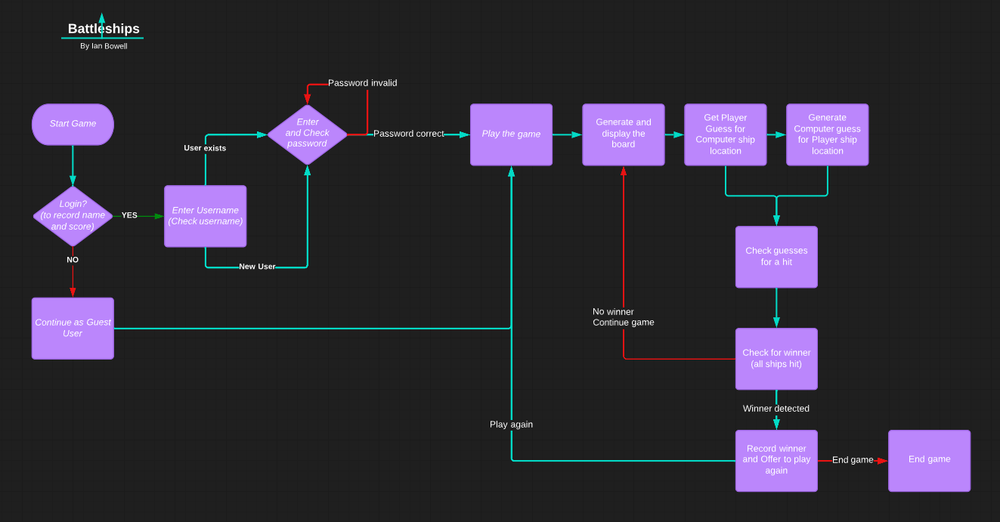
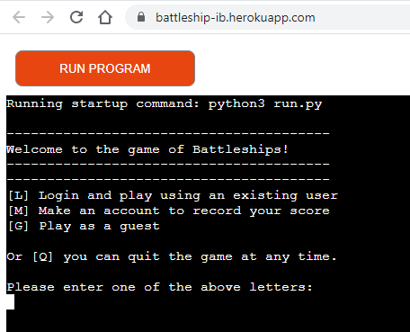

## About my project
# Welcome!

This is my Code Institute README for deploying my third portfolio project, the Python command-line project. 
The last update to this file was: **November 2, 2022**

The aim of the game is to view a map/grid of possible locations for opponent's ships and try and locate the opponent's ships before their computer finds yours.
I studied lots of examples on github and built my work flow from there, leading to the initial main loop and various functions with some refactoring to reduce repetition.
I also wanted improve on existing versions to ensure the board layout has both computer and player boards side by side horizontally to help visualisation and save vertical screen space. This provides an alternative to many existing versions of this game which use a lot of vertical space.
I also added more exception handling of the Google sheet interactions, as well as other input exception handling.

## Deployment
* My code has been deployed to Heroku at https://battleship-ib.herokuapp.com/

## The rules
- Battleships is a classic game that has been enjoyed for generations.
- I remember playing a version, with my friends and siblings, in a blue plastic case, with red and blue plastic pins.
- Before that it was a simple pencil and paper game. 
- The aim of the game is to guess the grid location of your opponent's ships, thus hitting and sinking the other player's ships before they sink yours. 
- Each player takes a turn, guessing the grid location where the opponent's ships are located. 
- This continues until all either player’s ships have all been hit. 
- The winner is the player with ships still remaining. 

------
## Flow chart

* [Back to top of README.md](#about-my-project) 

------
## **Features**

- Start screen

------

- Login screen

------

- Login pause info

------

- First screen

------

- Move Entry results

------

- First Move results

------

- First Column of shots fired - and out of range error checking

------

- Two Thirds played and computer may win?

------

- Player loses at nearly 80 percent played

------

- Player wins

------

- Recording of user results to GSheet

------

- Quitting after losing

------

- Choose to Make user

------

- Thanks for making user

------

- Error check in game - only 1 coordinate entered

------

- Error check in game - non digit coordinate entered

------

- Error check in game - too many coordinates entered

------

- Error check in game - coordinates missing comma

------

- Quit game at coordinate stage - during game

------

- Error check at login - retry password

------
### **Features to implement in future**

- I'd like to add more storyline, graphics and options for placing ships in user specified locations.
- And find a way to make a two player game so the computer moves are not necessary.
- I would also like to add colour, but conscious that may reduce accessibility
- Would be nice to add a leaderboard so people could compare themselves to the top 10 players

------
## **Technologies Used**
- [Python](https://www.python.org/)
- [GitHub](https://github.com/)
- [GitPod](https://www.gitpod.io/)
- [Heroku](https://www.heroku.com/about)
- [LucidCharts](https://www.lucidchart.com/pages/)

------
## **Testing**

The deployed Heroku site has been tested in Chrome, Firefox and Edge without issue. 

I tested this code manually with the following:

Check the code lint validation embedded in the Code institute python essentials template.
All issues have been resolved such as the 'line too long' and 'Missing module docstring' even though these issues don't affect the game, they maintain code quality.
I tested inputs with invalid inputs as listed in the testing results table below.
I tested the code in the Gitpod terminal and the deployed Heroku terminal.

### **Validation**

The usual linter website is not working, but the linter built into the template works fine, so fixes have been made as noted in the bugs section.
Gitpod's Linter shows no error for run.py file. 

* [Back to top of README.md](#about-my-project) 

### **Manual Testing**

| Feature | Test description | Validation | Outcome |
|:---|        :---| :---|:---|
| Name Input | Type in user's name | Check if empty | Pass |
| Start screen | Display start screen | Check if correct | Pass |
| Login screen | Display login screen | Check prompt | Pass |
| Login pause info | Display game info and pause | Check pause for enter key | Pass |
| First screen | Display first game screen | Check if correct | Pass |
| Move Entry results | Check move entry results | Check if correct | Pass |
| First Move results | First move results | Check if correct | Pass |
| First Column of shots fired | Check first five moves in first column | Check display of first column | Pass |
| Out of range error checking | Check if error when coordinate out of range | Check error message | Pass |
| Player loses | Check if player loses actions are correct | Check display for correct info | Pass |
| Player wins | Check if player wins actions are correct | Check display for correct info | Pass |
| Recording of user results to GSheet | Check if game results recorded | Check GSheet for new result | Pass |
| Quitting after losing | Check if game takes quit and exits | Check if correct | Pass |
| Choose to Make user | Check if new user created | Check GSheet for new user | Pass |
| Thanks for making user | Check if thanks given | Check display for thanks | Pass |
| Error check in game - only 1 coordinate entered | Check if game handles error | Check display | Pass |
| Error check in game - non digit coordinate entered | Check if game handles error | Check display | Pass |
| Error check in game - too many coordinates entered | Check if game handles error | Check display | Pass |
| Error check in game - coordinates missing comma | Check if game handles error | Check display | Pass |
| Quit game at coordinate stage - during game | Check if game quits | Check display | Pass |
| Error check at login - retry password | Check if game handles error | Check display | Pass |
| Tested guest login | Check if game allows guest login | Check display | Pass |

------
## Constraints

The deployment terminal is set to 80 columns by 24 rows. 
That means that each line of text needs to be 80 characters or less otherwise it will be wrapped onto a second line.

## Libraries used

In this project, 3 libraries are utilised, as instructed by Code Institute and their python project template

- The random library is imported to generate random numbers for the opponent ship placement coordinates and to generate the computer's next target location.
- The Google gspread library is imported to control the spreadsheet containing the username and passwords and the user's scores.
- The Google google.oauth2.service_account library is imported and the Credentials subsystem is used to authenticate and authorise the code to access the spreadsheet. 

------
## Bugs fixed
* fixed pylint warnings about trailing spaces, space after # in comments
* also fixed pylint error if using space between print command and opening bracket i.e. print ("test") is incorrect - should be print("test") with no space.
* fixed .gitpod.yml problems by adding the following lines to vscode: extensions: section of .gitpod.yml file
    - ms-toolsai.jupyter
    - ms-toolsai.jupyter-keymap
    - ms-toolsai.jupyter-renderers
* was also getting an error `Missing module docstringpylint(missing-module-docstring)`
    - fixed by adding a doc string (below) to the top of the run.py
    - """
    - Battleships game code
    - """
* learned this from https://stackoverflow.com/questions/65949325/how-do-you-fix-missing-module-docstringpylintmissing-module-docstring

## Reminders

* My code is placed in the `run.py` file
* My dependencies are placed in the `requirements.txt` file using `pip3 freeze` and directing the output or copying to requirements.txt
* remember to `pip3 install gspread google-auth` and  `pip3 install gspread` if import fails initially
* remember to create a Google works sheet and share sheet to a google email address identity
* If not using our Heroku deployed environment, you will need your own creds.json to access your own google spreadsheet.
* Do not edit any of the other files or this code may not deploy properly

## Creating the Heroku app

To create the app, I have added two buildpacks from the _Settings_ tab. The ordering is as follows:

1. `heroku/python`
2. `heroku/nodejs`

I have also created a _Config Var_ called `PORT`. Set this to `8000`

I have credentials, such as in the Love Sandwiches project, so have created another _Config Var_ called `CREDS` and pasted the JSON into the value field.

You should connect your GitHub repository and deploy as normal.
------
## **Deployment**

The site has been deployed through Heroku. 

The site has been developed on GitPod, committed and pushed to GitHub. 

Deployment proccess:

1. Log in [Github](https://github.com/).
    - Open the repo to deploy. 
    - The one for this project is [here](https://github.com/ian-IBCIRL/bat).
2. Log in [Heroku](https://www.heroku.com/).
    - Click in the "New" button in the top right.
    - Select "Create New App"
    - Give a name to the App and choose a region (Europe, for example).
    - Click in "Create App" button.
    - Go to Settings in the nav bar, and select "Add Buildpacks".
    - Add `Python` and save, do the same for `Node.js`, in that order. 
    - `Python` must show first in the list.
    - Go to Deploy in the nav bar. 
    - In Deploment Method, select GitHub/Connect to GitHub.
    - In Connect to GitHub (ideally with MFA), copy the repository name and click in search.
    - Once the route for the repo appears under the search, click in "Connect" button.
    - The deployment can be Manual or Automatic, select the one of your preference. 
    - Automatic has the advantage of updating your deployed site as you push the commit in GitHub.
    - Manual has the advantage of waiting until needed, rather than deploying evert time.
    - Verify that "Branch to deploy" is master/main.
    - Click Deploy.

Steps to use and deploy this repository:

- Access to the repo in GitHub [here](https://github.com/ian-IBCIRL/bat).
- It can be "Fork" following the steps [here](https://docs.github.com/en/get-started/quickstart/fork-a-repo).
- It can be "Clone" following the steps [here](https://docs.github.com/en/repositories/creating-and-managing-repositories/cloning-a-repository#cloning-a-repository).

* [Back to top of README.md](#about-my-project) 

------

## Release History

I have continually developed this project to help give you the best experience. 
Here is the version history:

**Oct 4th, 2022** 
- Planning initial project scope in the `README.md` file. 

**Oct 27th, 2022** 
- Added login creation and checking with score baseline logic.

**Oct 28th, 2022** 
- Added results checking and GSheet record keeping, with some display output layout changes, especially printing player boards horizontally to save vertical scrolling space.

**Nov 1st, 2022** 
- Updated testing and fixed docstring error as documented

* [Back to top of README.md](#about-my-project) 

-----
Happy coding!