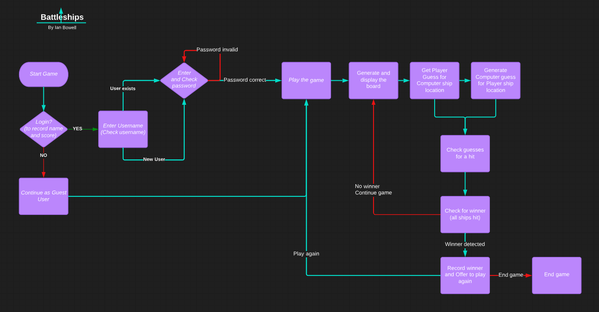

# Welcome!

This is my Code Institute README for deploying my third portfolio project, the Python command-line project. 
The last update to this file was: **October 18, 2022**

The aim of the game is to view a map/grid of possible locations for opponent's ships and try and locate the opponent's ships before their computer finds yours.

## Deployment
* My code has been deployed to Heroku at 

## The rules
- Battleships is a classic game that has been enjoyed for generations.
- I remember playing a version, with my friends and siblings, in a blue plastic case, with red and blue plastic pins.
- Before that it was a simple pencil and paper game. 
- The aim of the game is to guess the grid location of your opponent's ships, thus hitting and sinking the other player's ships before they sink yours. 
- Each player takes a turn, guessing the grid location where the opponent's ships are located. 
- This continues until all either player’s ships have all been hit. 
- The winner is the player with ships still remaining. 

## Flow chart

## Reminders

* My code is placed in the `run.py` file
* My dependencies are placed in the `requirements.txt` file
* remember to 'pip3 install gspread google-auth' if import fails initially
* remember to create a Google works sheet and share sheet to a google email address identity
* Do not edit any of the other files or this code may not deploy properly

## Creating the Heroku app

To create the app, I have added two buildpacks from the _Settings_ tab. The ordering is as follows:

1. `heroku/python`
2. `heroku/nodejs`

I have also created a _Config Var_ called `PORT`. Set this to `8000`

I have credentials, such as in the Love Sandwiches project, so have created another _Config Var_ called `CREDS` and pasted the JSON into the value field.

You should connect your GitHub repository and deploy as normal.

## Constraints

The deployment terminal is set to 80 columns by 24 rows. 
That means that each line of text needs to be 80 characters or less otherwise it will be wrapped onto a second line.

## Libraries used

In this project, 3 libraries are utilised, as instructed by Code Institute and their python template

- The random library is imported to generate random numbers for the opponent ship placement coordinates and to generate the computer's next target location.
- The Google gspread library is imported to control the spreadsheet containing the username and passwords and the user's scores.
- The Google google.oauth2.service_account library is imported and the Credentials subsystem is used to authenticate and authorise the code to access the spreadsheet. 

-----
Happy coding!